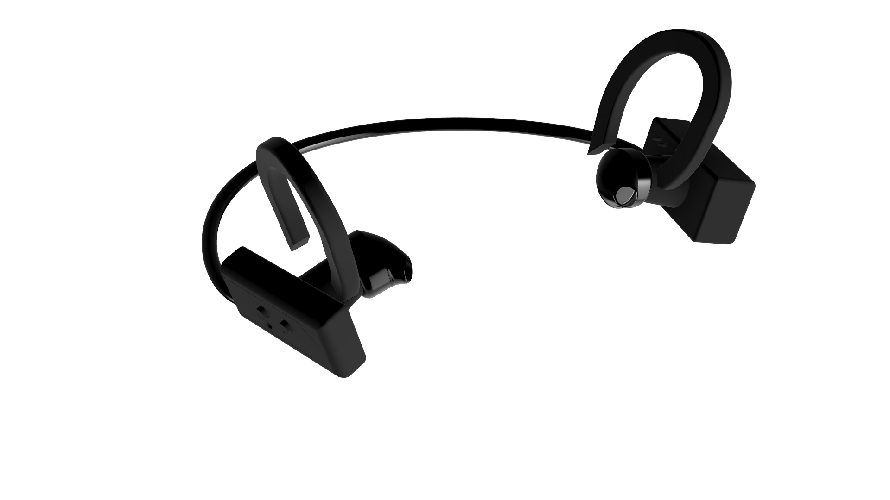
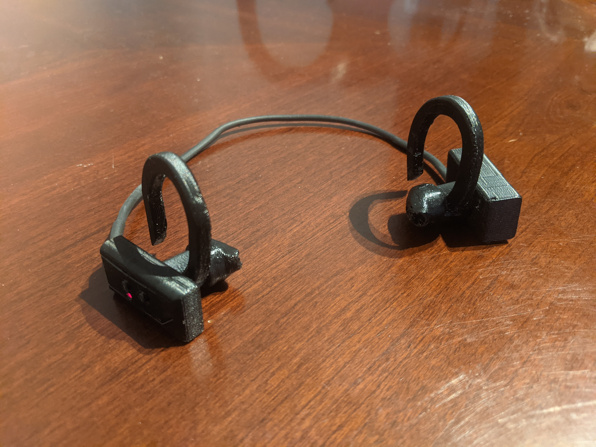

# Open Earphones

Open Source Modular Earphones that will last a lifetime if you build/fix them yourself.

After spending years buying earphones that would either break or have the battery die, I wanted to build my own pair from scratch in order to be able to repair or replace parts on it easily. Based off of Microchip's IS2083 chip and module, I prototyped custom circuit boards along with 3D printing the case in ABS and the ear-bud tips in flexible TPU.

CAD Files and  PCB files are available in this repo. BOM and a tutorial on how to put assemble them is coming soon.